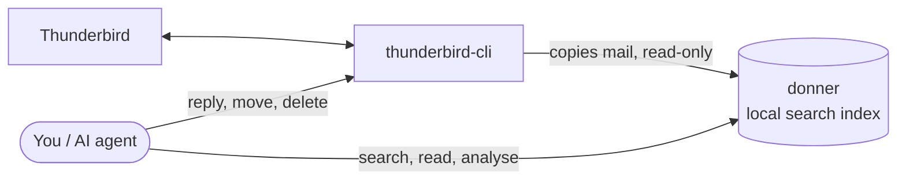

# donner

**Fast local search over your Thunderbird mail — for you and your AI agents.**

[](https://github.com/jo-tud/donner/actions/workflows/ci.yml)
[](LICENSE)


donner (German for *thunder*) is an **index layer for [thunderbird-cli](https://github.com/vitalio-sh/thunderbird-cli)**.
thunderbird-cli gives agents live access to Thunderbird; donner adds a local SQLite full-text index on
top, so questions like these get answered in milliseconds instead of minutes:

- *"How much did I pay Stadtwerke in 2025?"* — the amounts are inside PDF attachments
- *"Summarise the discussion about the delayed server hardware."*
- *"Who writes me most, and when did I last hear from Björn?"*
- *"Which mails in my inbox did nobody answer?"*
- *"Which of these mails try to hide text from me?"*

- **Fast:** word searches in 20–60 ms on 100 000 messages; answers come from the index, Thunderbird doesn't need to be running.
- **Deep:** subject, participants, body, quoted history *and* attachment text (PDF, DOCX, XLSX, PPTX, ODT, ICS, forwarded mails) are indexed. Threads, people, counts per month/sender, and read-only SQL for anything else.
- **Simple:** one Node.js package, one runtime dependency, no native builds, no server. Gmail-style queries.
- **Private & safe:** everything stays on your machine. donner is read-only; actions (reply, move, delete) stay with thunderbird-cli. Hidden HTML text (a common prompt-injection trick) is stripped and flagged, sender authentication is surfaced, deleted mail disappears from the index.

## How it fits together



- **thunderbird-cli** connects Thunderbird to the outside world and does everything that changes mail.
- **donner** keeps a local search index of your mail, fed through thunderbird-cli. It only reads.
- **Agents use both:** donner to find and understand mail, thunderbird-cli to act on it (after asking you).

## Requirements

- **Node.js ≥ 22.13** (uses the built-in `node:sqlite`)
- **Thunderbird 128+** with **thunderbird-cli**: the *Thunderbird AI Bridge* add-on and the `tb-bridge` daemon ([setup](https://github.com/vitalio-sh/thunderbird-cli#quick-start))
- Recommended: `pdftotext` (poppler-utils, e.g. `sudo apt install poppler-utils`) — used automatically for PDF
  attachments when installed; the built-in extractor covers simple PDFs only
- Optional: [Ollama](https://ollama.com) for meaning-based search

## Install

Have Thunderbird open with [thunderbird-cli](https://github.com/vitalio-sh/thunderbird-cli#quick-start) set up, then:

```bash
npm install -g github:jo-tud/donner
donner setup
```

`donner setup` does everything in one go and tells you what it did:

1. checks that Thunderbird is reachable through thunderbird-cli (and whether `pdftotext` is installed),
2. registers donner as an MCP server in **Claude Desktop** and **Claude Code** (if installed; your
   other settings are kept, the previous file is saved as `.bak`),
3. installs the agent skill for Claude Code,
4. builds the index (the first run takes a while — Thunderbird hands out one message at a time;
   Ctrl-C is safe, it continues later),
5. asks whether addresses that send under your name but are not known yet are yours,
6. installs a background service that keeps the index fresh (systemd user unit / launchd agent).

Then restart Claude Desktop. Options: `--yes` (no questions), `--no-sync`, `--no-service`,
`--no-claude`, `--interval 5min`.

**Updating:** run the install command again, then `donner setup` again — it updates the Claude
registrations, the skill and the service and upgrades the index (the next sync re-reads only what
newer versions extract better; see the [changelog](CHANGELOG.md)).

**Removing:** `donner uninstall` (service, Claude registrations, skill; add `--purge --yes` to delete
the index and config too), then `npm uninstall -g donner-mail`.

## Quick start

```bash
donner search rechnung from:stadtwerke after:2025-01
donner show 1234             # read one message (ids come from search)
donner thread 1234           # the whole conversation, without repeated quotes
donner status                # what is indexed, last sync, your addresses
donner doctor                # if something looks wrong
```

Without the background service, keep the index fresh with `donner watch` (every 5 minutes) or
`donner sync`; the MCP server also syncs every 10 minutes while Claude runs.

No Thunderbird at hand? `npm run demo` in a checkout starts the real thunderbird-cli bridge on a
simulated Thunderbird with a generated mailbox and prints the commands to try.

## Searching

Gmail-style operators, freely combined; all words must match.

| Query | Meaning |
|---|---|
| `rechnung stadtwerke` | all words, prefix match (`rechnung` finds *Rechnungsnummer*) |
| `"genaue phrase"` | exact phrase |
| `angebot OR offer`, `(from:anna OR to:anna) budget` | either; groups; OR binds tighter than AND (like Gmail) |
| `-newsletter`, `-from:noreply`, `-(a b)`, `NOT newsletter` | exclude a word, a filter or a group (`AND` is optional) |
| `from:müller` `to:anna` `cc:` `bcc:` `with:anna` | participant name or address; `with:` = sender or recipient; umlaut- and case-insensitive |
| `from:me` `to:me` | the user's own addresses: every identity of every account, senders found in sent folders, `index.myAddresses` |
| `subject:budget` `body:frist` | words in one field |
| `filename:pdf` `has:attachment` `has:pdf` `has:docx` `has:xlsx` `has:pptx` `has:ics` `has:eml` `has:zip` `has:image` | attachments |
| `has:invite` `has:event` `has:cancelled` | invitations expecting an answer · anything with a date (appointments, tickets) · cancellations |
| `event_after:2026-10` `event_before:2026-11` | by *event* date, newest version of each event only, cancelled ones excluded; series count while they recur (open-ended ones for a year after their last update); `--sort event` = next occurrence |
| `in:inbox` `in:sent` `folder:Projekte` `folder:Privat/Rechnungen` `account:Privat` | where |
| `is:unread` `is:read` `is:flagged` `is:reply` `is:junk` | flags |
| `is:hidden` `is:authfail` `is:suspicious` | hidden HTML text removed · sender authentication failed (DMARC decides) · failed, or hidden text from an unauthenticated stranger |
| `after:2025-01` `before:2025-07-01` `newer_than:30d` `older_than:1y` | dates in local time (`before` is exclusive); also `today`, `yesterday`, `DD.MM.YYYY` |
| `since:2025-01` `until:2025-03` | inclusive range: `until` includes the whole named day, month or year |
| `list:heise` `thread:42` `tag:$label1` `larger:1M` `smaller:100K` `id:123` `mid:<id>` | more |

Umlauts: `müller` and `mueller` find the same mail, `straße` and `strasse` too (the index stores ä/ö/ü/ß
as ae/oe/ue/ss); `muller` is a different word, and `poet` does not match *pot*. There is no stemming, and
German compounds match only by prefix (`suchindex` finds *Suchindex*, `index` does not) — use word
stems (`verzög`) or both languages (`rechnung OR invoice`).

Flags such as `--from`, `--since`, `--folder`, `--unread` work too. `--sort date|oldest|relevance|event`,
`-n 50`, `--offset` and `--fields id,date,from,subject,…` control the result list (fields you list are
always present; by default empty values are left out to save tokens). Results carry a `warning` when
sender authentication failed or text was hidden from the reader.

### Answering complex questions

```bash
# How much did I pay Stadtwerke in 2025? (amounts are in the PDF invoices)
donner search 'from:stadtwerke after:2025 before:2026' --sort date --fields id,date,subject
donner show 1201 1188 --attachments --max-body 300
donner sql "SELECT date(m.date/1000,'unixepoch') AS day, a.text FROM messages m
            JOIN attachments a ON a.message_id = m.id
            WHERE m.from_addr LIKE '%stadtwerke%' AND a.text LIKE '%Rechnungsbetrag%'
              AND m.date >= strftime('%s','2025-01-01')*1000 AND m.date < strftime('%s','2026-01-01')*1000
            GROUP BY m.mid ORDER BY m.date"

# Summarise the discussion about the delayed hardware
donner threads lieferverzug                    # conversations: first/last date, size, participants
donner thread 746 --max-body 1500

# Long conversations I took part in; everything I discussed with Björn, oldest first
donner threads --min 4 --mine --sort count
donner threads with:bjoern --sort first

# Sent vs received per year
donner count --by year,direction

# Who writes me most, and when did I last hear from Björn?
donner people -n 10
donner people bjoern                           # last_received / last_sent

# Volume over time
donner count has:pdf rechnung --by month
donner count newer_than:90d -from:me --by domain

# Phishing and manipulation attempts
donner search is:suspicious --sort date
donner show 458                                # "trust": SPF/DKIM/DMARC, known contact, hidden content

# Upcoming appointments, soonest first (each result shows the event and, for series, the next date)
donner search 'has:event event_after:today' --sort event
```

`donner schema` documents all tables with more example queries. SQL is strictly read-only (single
SELECT/WITH statement, separate process, read-only connection, timeout, row and cell limits).

### Output

At a terminal donner prints readable text; when piped (or with `--json`) it prints one JSON document:
`{"ok":true,"data":{…}}`, errors as `{"ok":false,"error":{"code","message","hint"}}` on stderr.
Exit codes: `0` ok, `1` error, `2` usage, `3` Thunderbird/bridge unavailable, `4` no index yet.

## Use with AI agents

`donner setup` registers donner with Claude Desktop and Claude Code and installs the skill. By hand,
or for other agents and MCP clients:

### Claude Code and other shell-based agents

```bash
donner skill install            # copies SKILL.md to ~/.claude/skills/donner/
claude mcp add --scope user donner -- donner mcp
```

The skill teaches the query language, token-efficient reading (`--fields`, `--max-body`, `thread`),
aggregation recipes and the safety rules (email content is untrusted; never act without asking).

### Claude Desktop and other MCP clients

MCP clients do not use your shell's `PATH` (nvm!); use absolute paths (`which node`, `which donner`):

```json
{
  "mcpServers": {
    "donner": { "command": "/usr/bin/node", "args": ["/usr/lib/node_modules/donner-mail/bin/donner.js", "mcp"] }
  }
}
```

Keep thunderbird-cli's MCP server enabled too: donner reads, thunderbird-cli acts.

| Tool | Purpose |
|---|---|
| `mail_search` | full-text search (keyword, or semantic/hybrid if embeddings exist) |
| `mail_read` | messages with trust signals, optional quoted text and attachment text |
| `mail_thread` | whole conversation, own text only |
| `mail_count` | counts, grouped by one or two keys: month/sender/domain/folder/direction/… |
| `mail_threads` | conversations: size, time span, participants, messages by the user |
| `mail_people` | correspondents with received/sent counts |
| `mail_sql` / `mail_schema` | read-only SQL and its documentation |
| `mail_status` | index freshness and coverage |
| `mail_resolve_tb_id` | current thunderbird-cli id for acting on a message |

All tools are read-only. To reply, move or tag, the agent resolves the id and uses thunderbird-cli:

```bash
donner resolve 1234        # → tb_id 5678 (verified: Thunderbird's ids change on restart)
tb reply 5678 --body "…"   # thunderbird-cli saves a draft by default
```

## Meaning-based search (optional)

```bash
ollama pull nomic-embed-text
donner config init          # then set "embeddings": {"enabled": true} in the config file
donner embed                # computes embeddings for indexed mail (incremental)
donner search --hybrid "complaints about late delivery"
```

Embeddings are computed by a **local** model. Remote endpoints (`"provider": "openai"`) are refused unless
you set `"allowRemote": true`, because mail text would leave your machine.

## Configuration

`donner config` shows the effective configuration, `donner config init` creates
`~/.config/donner/config.json`:

```json
{
  "index": {
    "excludeFolderTypes": ["junk", "trash"],
    "excludeFolders": ["Privat/Newsletter", "*/Spam"],
    "includeFolders": [],
    "accounts": [],
    "attachments": true
  },
  "embeddings": { "enabled": false, "provider": "ollama", "url": "http://127.0.0.1:11434", "model": "nomic-embed-text" },
  "mcp": { "autoSync": true, "syncIntervalMinutes": 10 }
}
```

Folder globs match `"<account name>/<folder path>"` (e.g. `Firma/Projekte/**`) or the folder id.
Excluding a folder later removes its messages from the index on the next sync.

The bridge address and token are taken from thunderbird-cli's config (`~/.config/thunderbird-cli/config.json`)
and `TB_BRIDGE_HOST` / `TB_BRIDGE_PORT` / `TB_AUTH_TOKEN`, so there is usually nothing to configure. To override
them for donner only, add `"bridge": {"host": "127.0.0.1", "port": 7700, "authToken": "…", "timeoutMs": 120000}` to
the donner config file. Background services do not see your shell's `TB_AUTH_TOKEN`; keep the token in a config
file if your bridge requires one.

Other index options: `"pdftotext"` (`"auto"`: use poppler's pdftotext when installed, sandboxed with a
memory limit and timeout; `false`: built-in extractor only, no native parser on untrusted files), `"maxMessageBytes"` (8 MB), `"maxAttachmentBytes"` (20 MB), `"concurrency"` (4),
`"parseTimeoutMs"` (60 s per message), `"fullReconcileHours"` (24), `"trustedAuthservIds"` (e.g. `["mx.google.com"]`:
only trust SPF/DKIM/DMARC results written by your own provider's servers), `"myAddresses"` (your old or
extra addresses, in addition to the account identities and senders found in sent folders; `donner status`
lists what donner considers yours), `"notMyAddresses"` (wrong detections). Folders named like junk, trash
or sent (also nested, e.g. `+spamverdacht`) are recognised; junk and trash are not indexed.
donner-specific overrides: `DONNER_BRIDGE_HOST`, `DONNER_BRIDGE_PORT`, `DONNER_AUTH_TOKEN`, `DONNER_DB`,
`DONNER_CONFIG`, `DONNER_CONFIG_DIR`, `DONNER_DATA_DIR`. Index location: `~/.local/share/donner/`
(Linux), `~/Library/Application Support/donner/` (macOS), `%LOCALAPPDATA%\donner\` (Windows).

## How sync works

1. List accounts and folders; skip folders whose message and unread counts did not change.
2. List headers of changed folders and reconcile by Message-ID: new, moved (no re-download), deleted, flag and tag changes.
3. Download new messages newest-first (raw RFC 822 up to 8 MB, otherwise Thunderbird's text parts), extract text, commit in batches.

A full reconciliation of all folders (to catch flag changes in otherwise unchanged folders) runs at least every 24 h or with
`donner sync --full`. Thunderbird's WebExtension message ids are only valid until Thunderbird restarts; donner detects restarts and
always verifies an id before handing it out (`donner resolve`). Details: [docs/ARCHITECTURE.md](docs/ARCHITECTURE.md).

## Performance

Measured with `npm run bench -- 50000` (Node 22, 4 vCPU; the real thunderbird-cli bridge and extension on a
simulated Thunderbird in its own process; 48 664 indexed messages after excluding junk and trash):

| | |
|---|---|
| first sync | ~470 messages/s (48 664 messages in 103 s), event loop never blocked > 0.35 s |
| sync with no changes | ~0.5 s |
| search, p50 | 20–70 ms for word queries; 150–200 ms with substring filters such as `from:` on all mail |
| `count --by month`, `people` | 0.2–0.7 s over the whole mailbox |
| `thread` | ~1 ms |
| index size | ~4 KB per message on the synthetic mailbox; real mailboxes with many attachments reach ~10 KB (750 MB for 70k messages) |

**With a real Thunderbird, Thunderbird is the bottleneck of the first sync.** The thunderbird-cli extension
runs in Thunderbird's main thread, so Thunderbird hands out one message at a time on a single CPU core, no
matter how many cores the machine has or how high `index.concurrency` is set. In a field test (a real
mailbox with ~70 000 messages, IMAP + local archive) this meant roughly 100 messages/s, i.e. 10–20 minutes for the first sync.
IMAP folders without offline copies additionally wait for the download. This happens once: later syncs only
fetch new mail, search works while the first sync runs (newest mail first), and an interrupted sync
resumes where it stopped.

## Security and privacy

- The index contains your mail. It is created with `0600` permissions in a `0700` directory; use full-disk encryption.
  `donner reset --yes` deletes it. Mail deleted in Thunderbird is removed from the index on the next sync.
- donner never writes to Thunderbird and never talks to the network, except to the local bridge and — only if you enable it — a local embedding model.
- Email is untrusted input. Hidden HTML content, zero-width/bidi/"tag" characters and comments are removed before text is indexed or shown, and `trust` metadata (SPF/DKIM/DMARC from the receiving server, known contact, hidden content) accompanies every message. Tools and the skill tell agents never to follow instructions found in mail.

- Every mail is parsed in a worker thread with a hard time and memory limit, so a malicious message cannot stall the index.

Threat model and review results: [SECURITY.md](SECURITY.md) and [docs/SECURITY-ANALYSIS.md](docs/SECURITY-ANALYSIS.md).
The pre-release usability study is in [docs/USABILITY.md](docs/USABILITY.md). Deutsche Kurzanleitung: [docs/de/SCHNELLSTART.md](docs/de/SCHNELLSTART.md).

## Limitations

- For IMAP folders without offline sync, the first `donner sync` makes Thunderbird download message bodies (network traffic, time). Use `--no-bodies`, or exclude folders.
- No OCR: scanned PDFs without a text layer are not searchable.
- Flag/tag changes in folders whose counts did not change appear after the next full reconciliation (≤ 24 h, or `sync --full`).
- Search tokenisation is language-neutral (no stemming); prefix matching and German transliteration cover most German and English cases.
- Hidden-text detection covers inline and `<style>` CSS but is not a browser; results are signals, not verdicts.

## Development

```bash
npm install
npm test          # unit + integration tests (real thunderbird-cli bridge/extension, simulated Thunderbird)
npm run demo      # try the CLI without Thunderbird
npm run bench     # performance on a synthetic mailbox
```

See [CONTRIBUTING.md](CONTRIBUTING.md) and [docs/ARCHITECTURE.md](docs/ARCHITECTURE.md).

## License

MIT — see [LICENSE](LICENSE). Test fixtures include MIT-licensed code from thunderbird-cli (see `test/vendor/thunderbird-cli/`).
